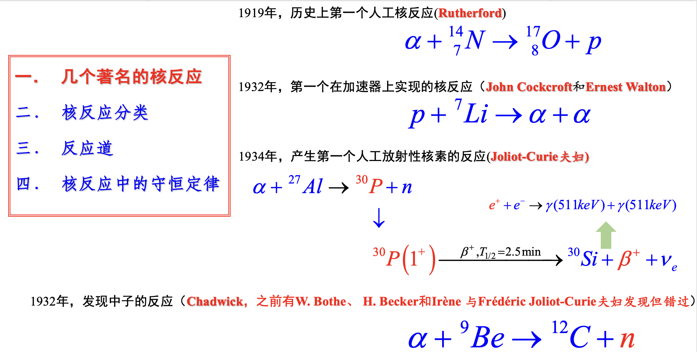
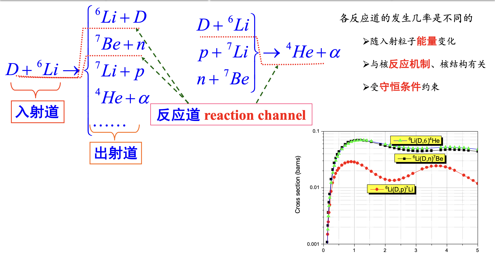

# 原子核反应概况

## 核反应分类

### 按出射粒子分类

1. 核散射:出入射都是同种粒子
   1. 弹性散射
   2. 非弹性散射
2. 核转变
   1. 出射粒子有$\gamma$,叫做辐射俘获
   2. 入射粒子有$\gamma$,叫做光核反应,核光电效应

### 按入射粒子分类

1. 中子核反应
2. 带电粒子核反应
3. 光核反应

### 按入射粒子能量分类

1. 低能:<30MeV(一般是低能)
2. 中能:30-1000MeV
3. 高能:>1000MeV

## 反应道

## 核反应中的守恒定律

电荷、核子数、能量、动量、角动量、宇称

# 核反应能和Q方程

## 反应能

