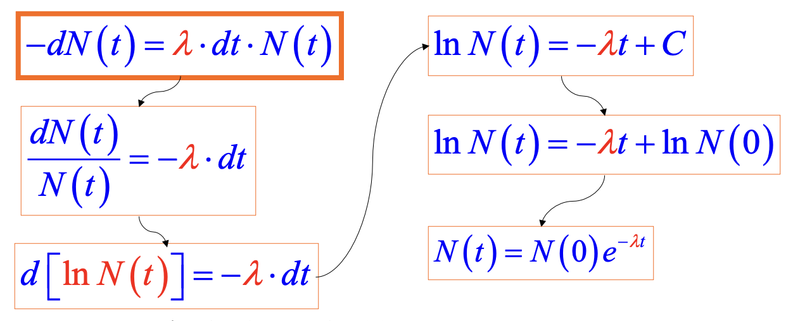
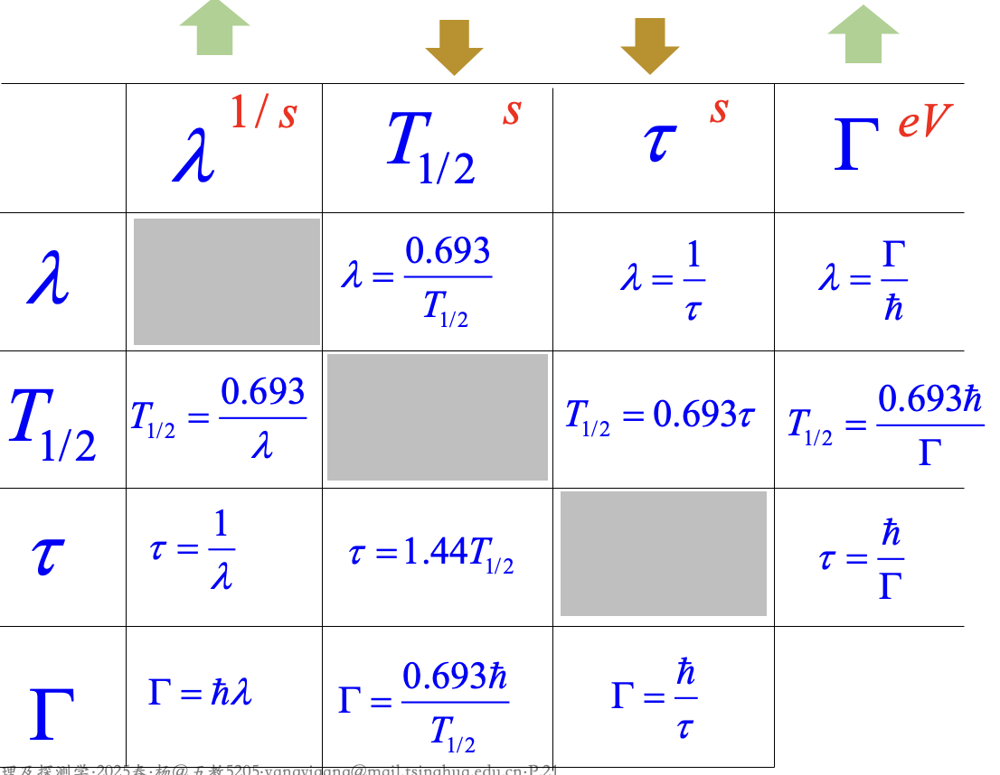

# 放射性衰变的基本规律

全同、独立、随机,统计过程

## 衰变常数、半衰期、平均寿命和衰变宽度

==衰变率==$J(t)=\frac{-dN(t)}{dt}=\lambda N(t)$

==衰变常数==$\lambda$,单位是时间的倒数

$\lambda=\sum \lambda_i$(衰变常数等于分支衰变常数之和)

**分支比**$R_i=\frac{\lambda_i}{\lambda}$

**绝对强度vs分支比:**  
一个是全局量,对应的是主核素-->子核素  
一个是局部量,对应的是具体核素-->对应的子核素  
衰变纲图提供的是**绝对强度**,不是**分支比**

==半衰期==:$T_{\frac{1}{2}}=\frac{ln2}{\lambda}\approx\frac{0.693}{\lambda}$

==平均寿命==$\tau=\frac{1}{\lambda}\approx 1.44T_{\frac{1}{2}}$(推导过程见[链接](https://chatgpt.com/share/69b167ae-f3fc-8006-bc4e-b73bdcccddf9))

==衰变宽度==$\Gamma_a=\frac{\bar{h}}{\tau_a}$

==放射性活度==$A(t)=\frac{-dN(t)}{dt}=\lambda N_0e^{-\lambda t}=\lambda N(t)$(指的是发生衰变的原子核的数目,不是放出的粒子数目)

==比活度==$a=\frac{A}{m}$(**单位质量**放射源的活度)

# 递次衰变规律

