# 放射性衰变的基本规律

全同、独立、随机,统计过程

## 衰变常数、半衰期、平均寿命和衰变宽度

==衰变率==$J(t)=\frac{-dN(t)}{dt}=\lambda N(t)$

==衰变常数==$\lambda$,单位是时间的倒数

$\lambda=\sum \lambda_i$(衰变常数等于分支衰变常数之和)

**分支比**$R_i=\frac{\lambda_i}{\lambda}$

**绝对强度vs分支比:**  
一个是全局量,对应的是主核素-->子核素  
一个是局部量,对应的是具体核素-->对应的子核素  
衰变纲图提供的是**绝对强度**,不是**分支比**

==半衰期==:$T_{\frac{1}{2}}=\frac{ln2}{\lambda}\approx\frac{0.693}{\lambda}$

==平均寿命==$\tau=\frac{1}{\lambda}\approx 1.44T_{\frac{1}{2}}$(推导过程见[链接](https://chatgpt.com/share/69b167ae-f3fc-8006-bc4e-b73bdcccddf9))

==衰变宽度==$\Gamma_a=\frac{\bar{h}}{\tau_a}$

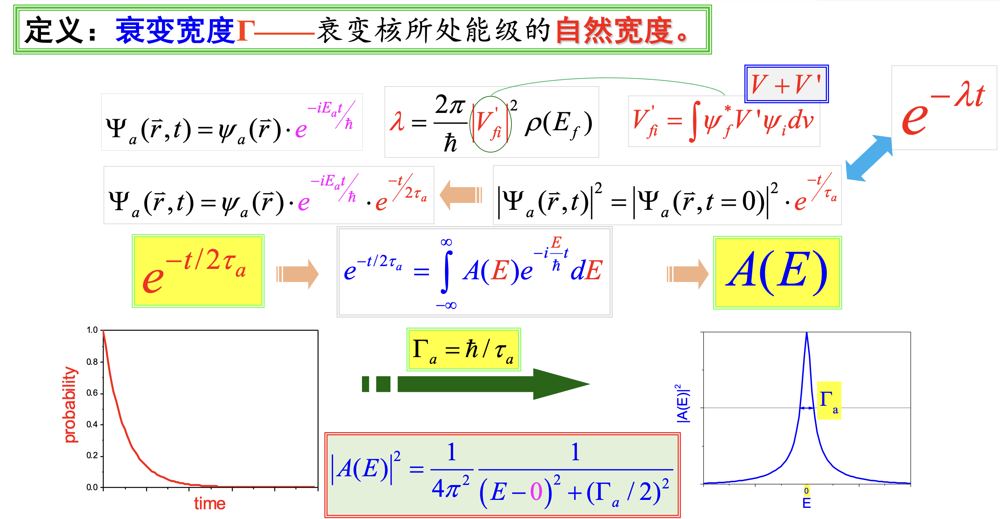
==$E=\bar{h}\omega$==,这是通过傅立叶变换分解出不同能量的概率,最后取最高点的一半作为衰变宽度

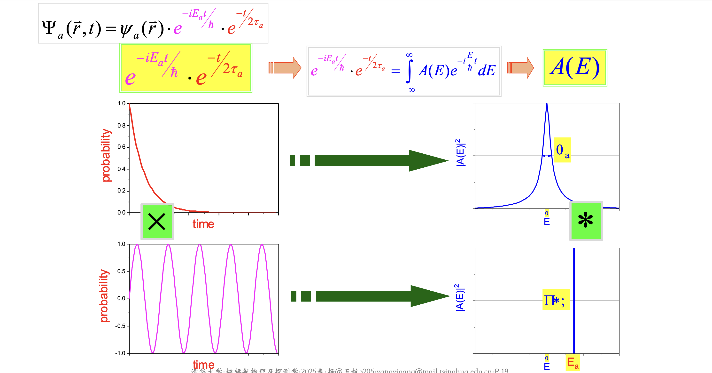
时域相乘,频域卷积

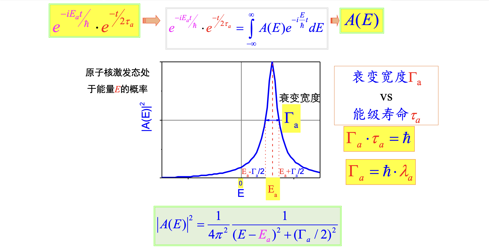
卷积就是频移

==放射性活度==$A(t)=\frac{-dN(t)}{dt}=\lambda N_0e^{-\lambda t}=\lambda N(t)$(指的是发生衰变的原子核的数目,不是放出的粒子数目)  
单位:居里$Ci=3.7\times10^{10}$每秒;贝克$Bq=1$每秒

==比活度==$a=\frac{A}{m}$(**单位质量**放射源的活度)

# 递次衰变规律

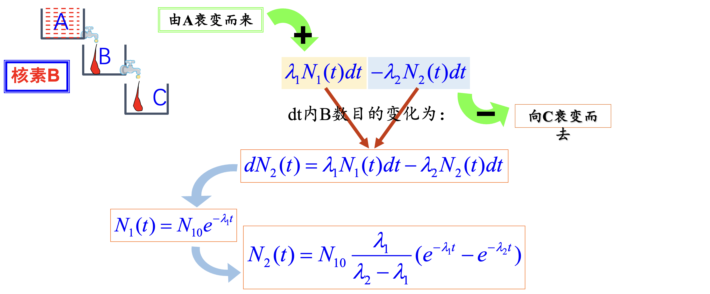
证明参见[链接](https://chatgpt.com/s/t_69b7dbcf49548191bbc6d3eb80f73847)

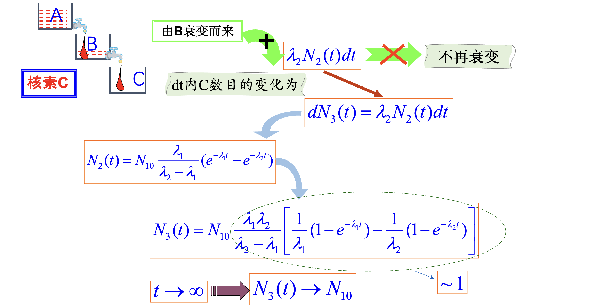

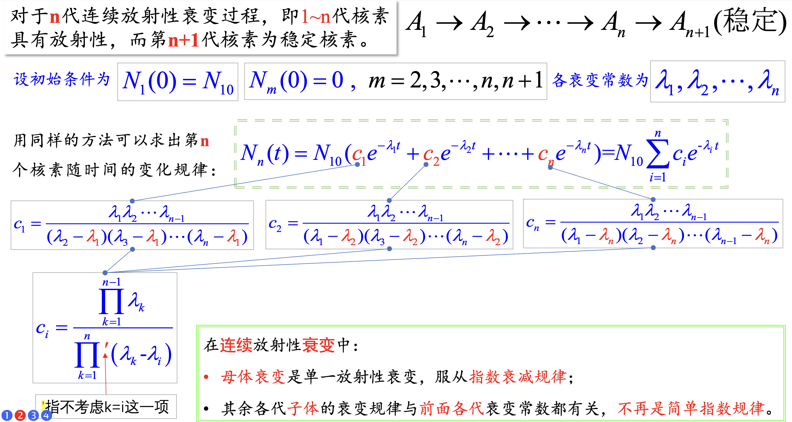

## 暂时平衡
条件:$T_1>T_2,\lambda_1<\lambda_2$,$T_1$也不能过大

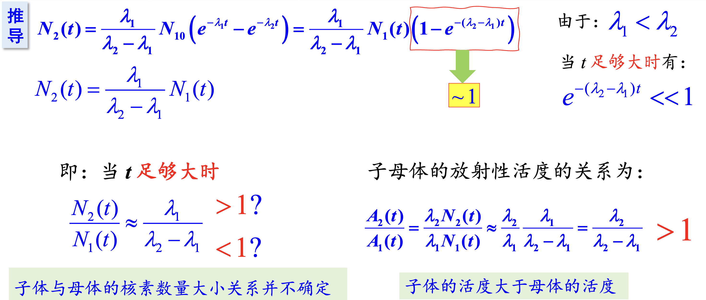

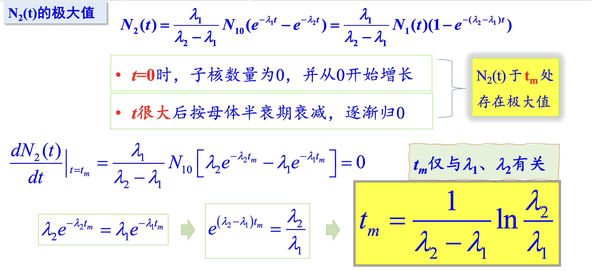

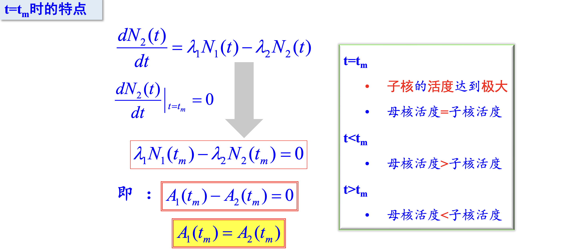

$t_m$受子核半衰期影响更大

## 长期平衡

条件:$T_1>>T_2,\lambda_1<<\lambda_2$

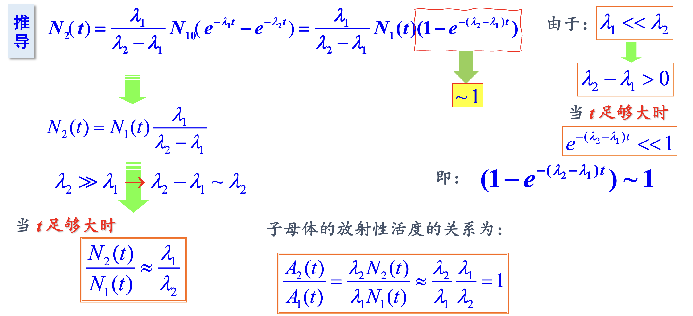

$t_m$受子核半衰期影响更大

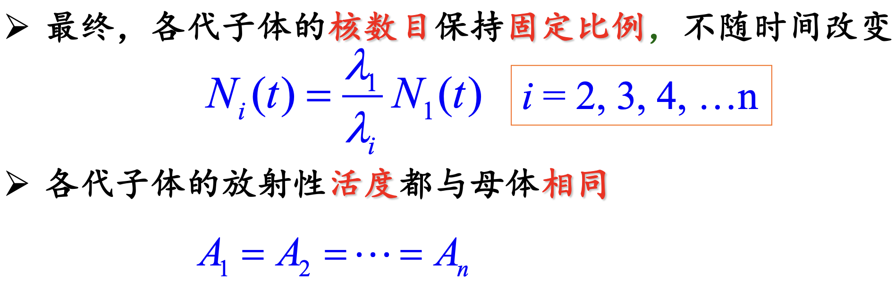

## 逐代衰变

条件:母体衰变比子体快

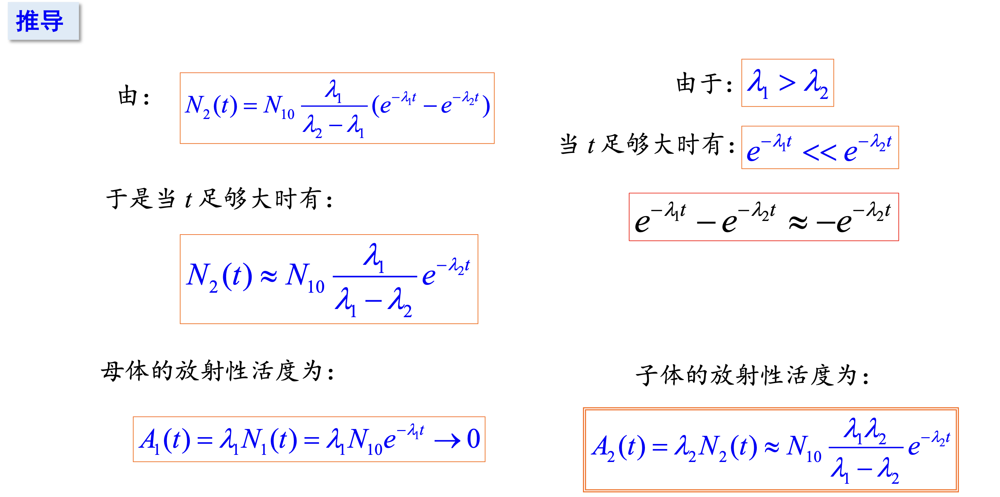

$t_m$受母核半衰期影响更大

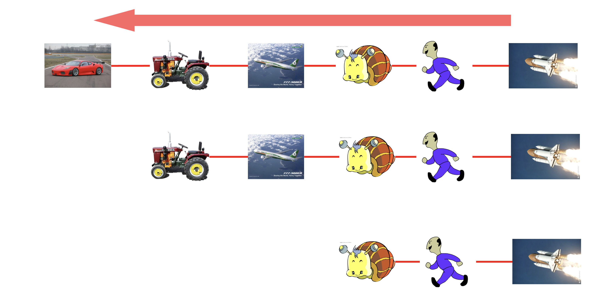
*揭示规律的神图*

# 放射系

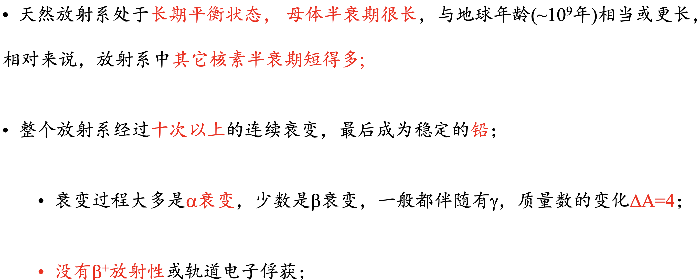

# 放射规律的应用

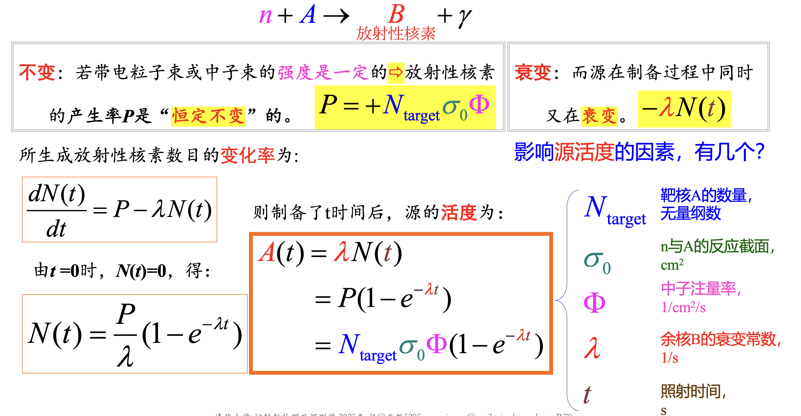

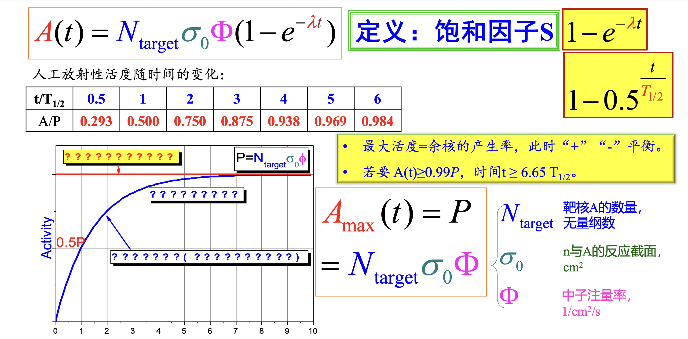

母牛原理:利用寿命较长的母核,不断产生短寿命子体,需要时分离出子体即可.这样就可以运输短寿命子体了