# $\alpha$衰变

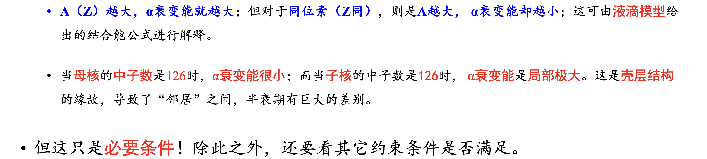

$\alpha 粒子动能和 \alpha 衰变能之间的关系:E_0=\frac{A}{A-4}T_{\alpha}$

在核能级图中,先通过质量过剩算出基态的能量

在核中,$\alpha$核出射的概率为:  
$P=e^{-2a\kappa}$;$\kappa=\frac{\sqrt{2m(V_r-E_0)}}{\bar{h}}$
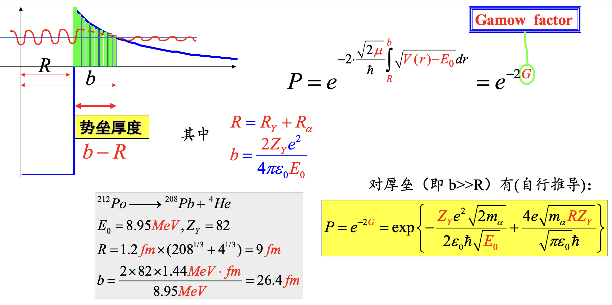

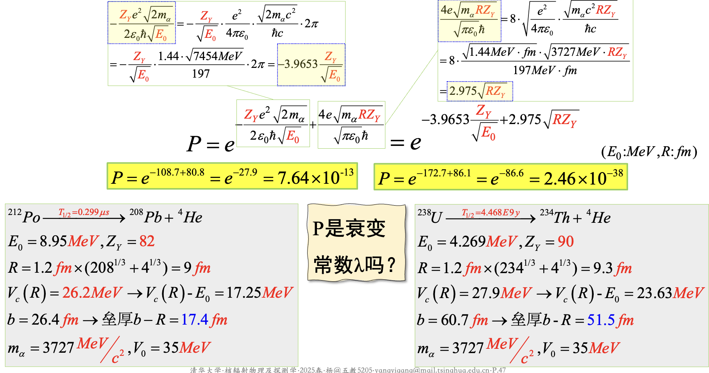
*$E_0$的影响更大,因为$Z_Y$相近且很大,而$E_0$可以为4-9MeV*

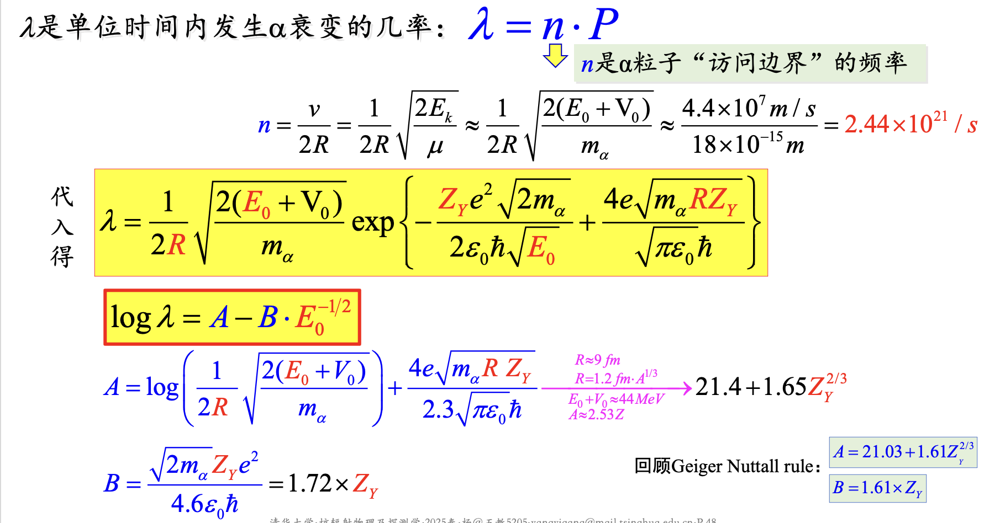

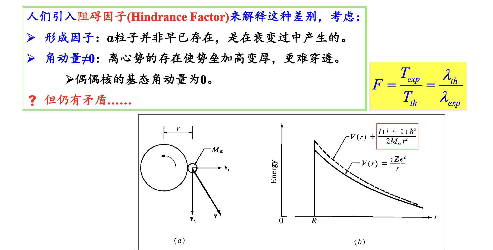
离心势和库伦势垒形式类似,只是它是由$r^{-2}$来决定的

### 宇称和自旋

自旋还是从两个相减到两个相加,宇称是子核宇称乘$\alpha$的宇称等于母核宇称,$\alpha$的宇称由轨道角动量(也就是上面算的自旋)决定,也就有了*当子母核都是0自旋时,可能出现由于宇称的原因限制了$\alpha$衰变的发生*

# $\beta$衰变

## 什么是$\beta$衰变

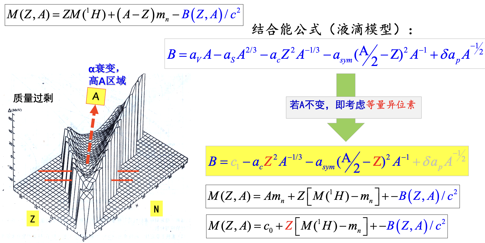

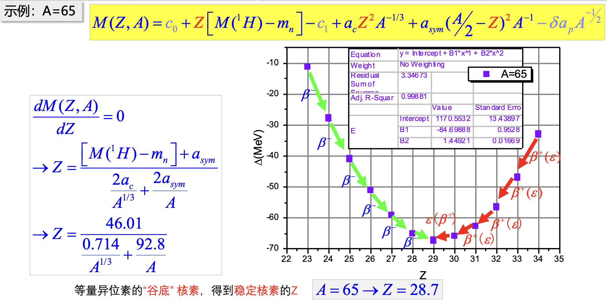
二次型,是抛物线

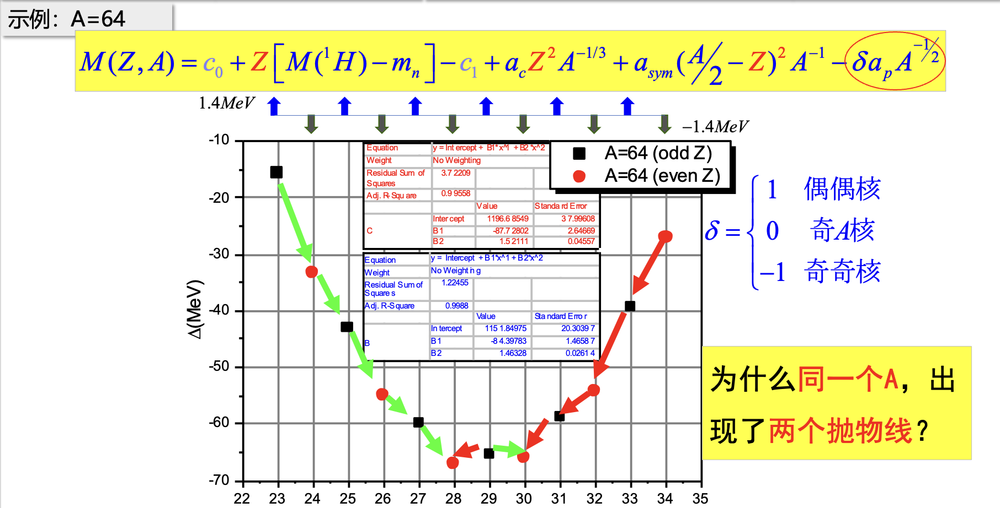
偶A核,一个奇奇核一个偶偶核,对能项出现,导致有两个抛物线

## 中微子假说

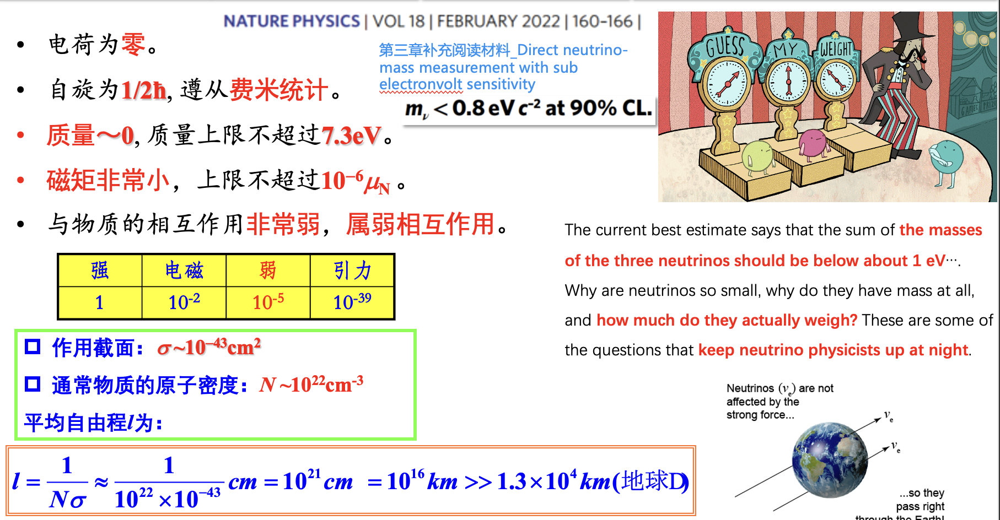
想去哪就去哪,甚至可以穿过地球

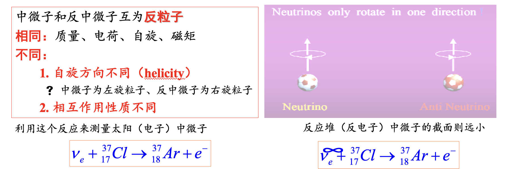
反中微子,来源不同,自旋方向不同,作用截面不同

## $\beta$衰变的三种类型
1. 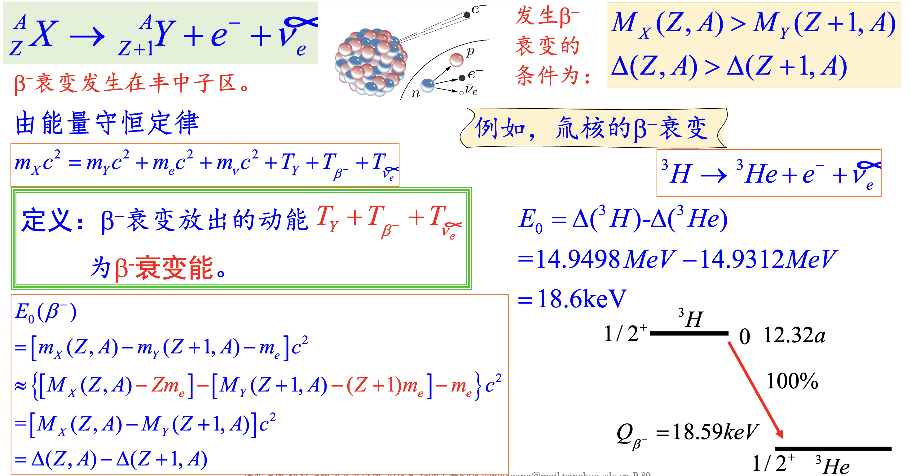
2. 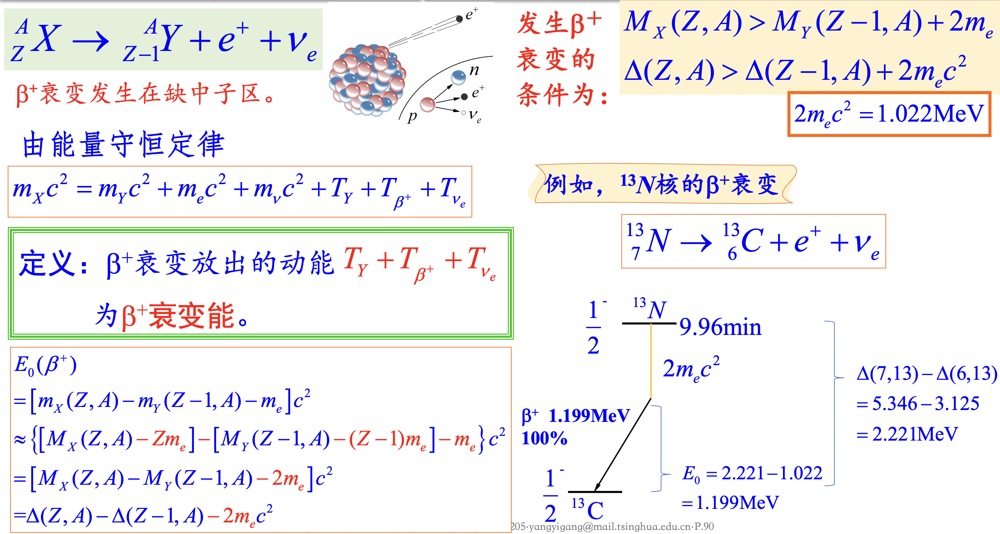
   注意橙色框中应该大于的能量
3. 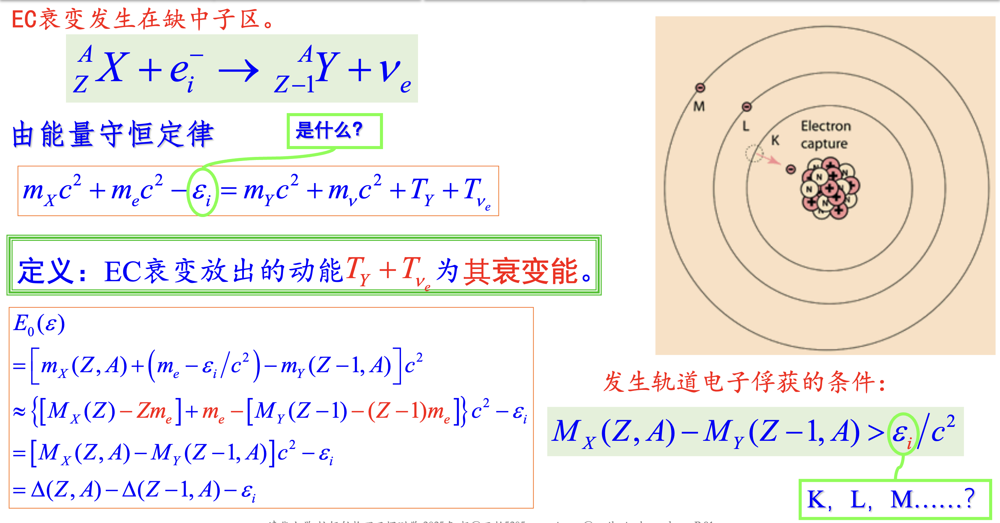
    高Z原子的K层电子最容易被俘获,但是高Z又带来了衰变能不高的问题,又会导致K层不能俘获,只能LM层  
    可以通过探测特征X射线以及俄歇电子能量来判断是否发生EC

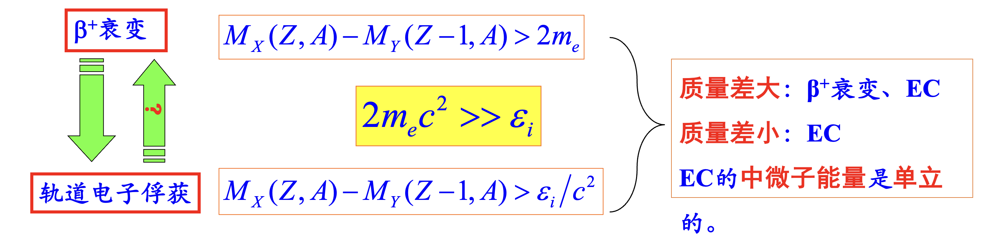

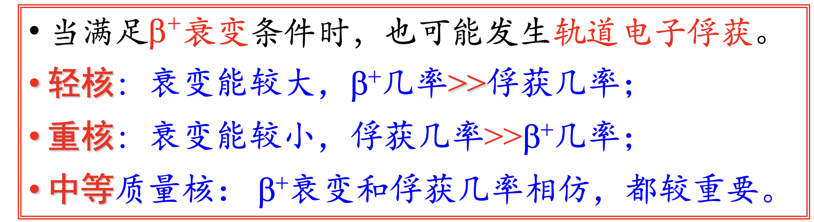

三体问题导致了连续能谱,故EC是分立的(两体)

## 费米理论、选择定则

# $\gamma$衰变

