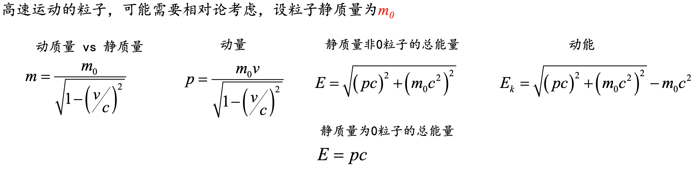
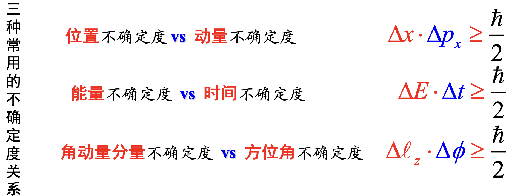
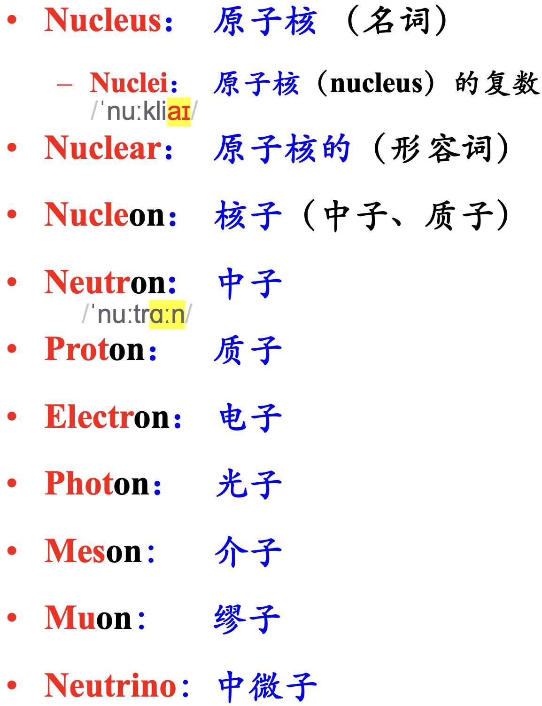

**“唯象”的方法**

每个对象有每个对象特殊的分析方法，彼此之间不通用。

# 重要常数

# 相对论公式

# 波粒二象性

$$
\lambda = \frac{h}{p}
$$

# 不确定关系

# 原子核质量、组成和半径

*一些名词*

1. ==同位素丰度==：元素中各同位素天然含量的**原子数**百分比
2. ==同中异荷素==：N同Z不同
3. ==同量异位素==：A同，N、Z之一不同
4. ==同质异能态== vs ==同质异能素==
5. 偶A核（偶偶核、奇奇核），奇A核
6. 镜像核：N、Z互换
7. 我们虽然讨论原子核质量,但是用的是原子质量
8. 1u略等于一个质子或一个中子的质量.A是u有为单位的取整值,即为质量数
9. ==质量过剩==就是原子质量$M-A$的小数部分,以$u$为单位,可正可负
10. 电荷半径和荷力半径相近,原子核半径和核子数的开三次方成正比,体积和核子数成正比

# 原子核稳定性试验规律

经验公式
$$
Z=\frac{A}{1.98+0.0155A^{\frac{2}{3}}}
$$
A较小,N/Z略等于1;  
A较大,N/Z大于1

只有在$\beta$衰变曲线上的原子核才可能稳定.  
==丰质子核素==EC,$\beta^+$衰变  
==丰中子核素==$\beta^-$衰变

偶偶核最稳定,奇奇核最不稳定  
*幻数*

# 原子核的结合能

