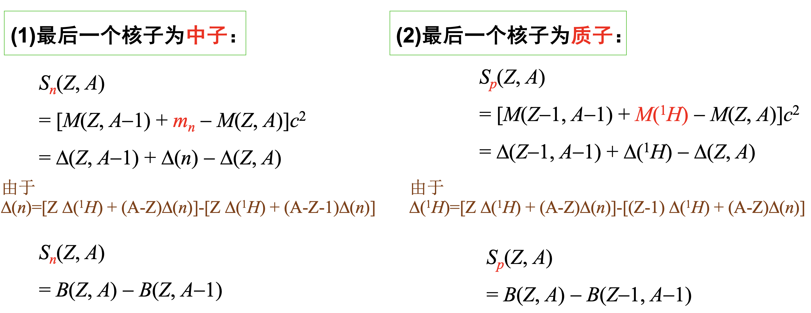
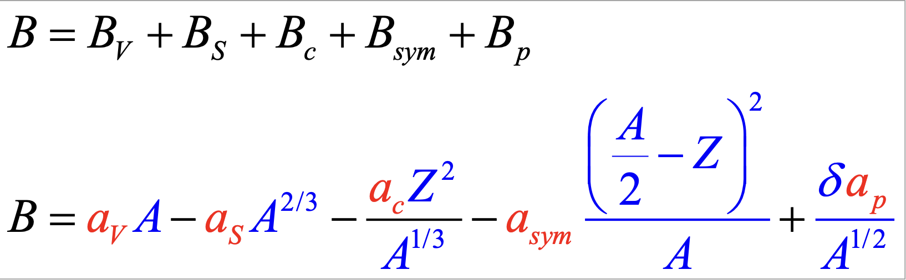
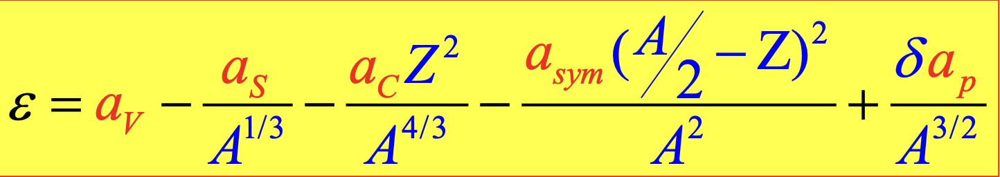

**“唯象”的方法**

每个对象有每个对象特殊的分析方法，彼此之间不通用。

# 重要常数

# 相对论公式

# 波粒二象性

$$
\lambda = \frac{h}{p}
$$

# 不确定关系

# 原子核质量、组成和半径

*一些名词*

1. ==费米子==:质子中子电子,半整数自旋  
vs  
==玻色子==:光子,整数自旋
2. ==同位素丰度==：元素中各同位素天然含量的**原子数**百分比
3. ==同中异荷素==：N同Z不同
4. ==同量异位素==：A同，N、Z之一不同
5. ==同质异能态== vs ==同质异能素==:是同一个东西
6. 偶A核（偶偶核、奇奇核），奇A核
7. 镜像核：N、Z互换
8. 我们虽然讨论原子核质量,但是用的是原子质量
9. ==1u==**略等于**一个质子或一个中子的质量(碳12是标准).A是u为单位的取整值,即为质量数
10. ==质量过剩==就是原子质量$M-A$的小数部分,以$u$为单位,可正可负
11. 电荷半径和荷力半径相近,原子核半径和核子数的开三次方成正比,体积和核子数成正比.  
    **经验公式**:$$R=1.2\text{fm}A^{\frac{1}{3}}$$

# 原子核稳定性试验规律

经验公式
$$
Z=\frac{A}{1.98+0.0155A^{\frac{2}{3}}}
$$
A较小,N/Z略等于1;  
A较大,N/Z大于1(库伦能限制)

只有在$\beta$衰变曲线上的原子核才可能稳定.  
==丰质子核素==EC,$\beta^+$衰变  
==丰中子核素==$\beta^-$衰变

偶偶核最稳定,奇奇核最不稳定  
*幻数*

# 原子核的结合能

质量亏损

结合能$B(Z,A)$  
注意质子用的是氢原子的质量

比结合能$\varepsilon(Z,A)$

*这一段推导预习时看了很久*

$\text{体积能}B_v=a_v\text{(核力做功)}\times A\text{(核子数)}$

$\text{表面能}B_S=-a_S\times A^{\frac{2}{3}}$(为负是因为表面受到的核力更弱,要扣除)

*库伦能的算法.过考虑那里是因为实际上的库伦能是累加不是积分,最后一项自己对自己的库伦能本来不该算在内,但是积分时算了,所以修正*

轻核内中子质子倾向**对称相处**  
$\text{对称能}B_{sym}=-a_{sym}\times (\frac{A}{2}-Z)^2\times A^{-1}$  
...N=Z时,对称能=0原子核稳定  
...N≠Z时,对称能<0核不稳定

各自趋向成对相处  
$\text{对能}B_{p}=\delta a_{p}\times A^{-\frac{1}{2}}$,
$\text{偶偶核、奇A核、奇奇核分别有}\delta=1,0,-1$

==结合能半经验公式==  

==比结合能半经验公式==

# 核力及核势垒

核力强相互作用、短程、饱和、**极短程内有排斥芯**、与自旋有关、有非中心力部分(同向自旋线列吸引、并列排斥)、自旋和轨道角动量关系也影响核力

$\text{库伦势垒公式 }V(R)=\frac{e^2}{4\pi\varepsilon_0}\frac{Z_1Z_2}{r_0(A_1^{\frac{1}{3}}+A_2^{\frac{1}{3}})}$

**中子没有库伦势垒**(能量低也能进入原子核,但是几率小)

**势垒对衰变/核反应射出带电粒子和核反应射入带电粒子都有阻碍作用!**

# 原子核的矩

